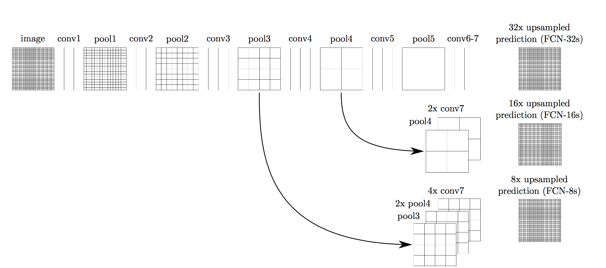

## Semantic Segmentation Project


The goal of this project is build a fully convolution network FCN to perform a semantic segmentation in a image indentifying the road and background


![alt text][image1]
ex of  semantic segmentation task


## Transfer Learning 
this project uses a VGG pre trained model the code to load the VGG model is in the function `def load_vgg(sess, vgg_path)`

## FCN Architeture
Striping the fully connected layer from the VGG model, the CN is converted to a fully convolution network fowlling the [paper] (https://people.eecs.berkeley.edu/~jonlong/long_shelhamer_fcn.pdf). The architecture of FCN can be seen in picture below from the same paper




The code below we can see the FCN-8 with two skip layer and a final upsampling of 8x, the skip layer at different scales helps the FCN detect feautures a different scales. 

```python
 with tf.variable_scope('FCN'):
        conv_1x1 = tf.layers.conv2d(vgg_layer7_out, num_classes, 1, strides=(1, 1), padding='same',
                                    kernel_initializer=tf.truncated_normal_initializer(stddev=0.01),
                                    kernel_regularizer=tf.contrib.layers.l2_regularizer(.01),
                                    name="conv_1x1")
       
        upsample1 = tf.layers.conv2d_transpose(conv_1x1, num_classes, 4, strides=(2, 2), padding='same',
                                               kernel_initializer=tf.truncated_normal_initializer(stddev=0.01),
                                               kernel_regularizer=tf.contrib.layers.l2_regularizer(.01),
                                               name="upsample1")
      

        vgg_layer4_out = tf.layers.conv2d(vgg_layer4_out, num_classes, 1, strides=(1, 1), padding='same',
                                          kernel_initializer=tf.truncated_normal_initializer(stddev=0.01),
                                          kernel_regularizer=tf.contrib.layers.l2_regularizer(.01),
                                          name="vgg_layer4_out")
        skip1 = tf.add(upsample1, vgg_layer4_out, name="skip1")
      

        upsample2 = tf.layers.conv2d_transpose(skip1, num_classes, 4, strides=(2, 2), padding='same',
                                               kernel_initializer=tf.truncated_normal_initializer(stddev=0.01),
                                               kernel_regularizer=tf.contrib.layers.l2_regularizer(.01),
                                               name="upsample2")
        

        vgg_layer3_out = tf.layers.conv2d(vgg_layer3_out, num_classes, 1, strides=(1, 1), padding='same',
                                          kernel_regularizer=tf.contrib.layers.l2_regularizer(.01),
                                          name="vgg_layer_3out")
        skip2 = tf.add(upsample2, vgg_layer3_out, name="skip2")
        
        
        final = tf.layers.conv2d_transpose(skip2, num_classes, 16, strides=(8, 8), padding='same',
                                           kernel_initializer=tf.truncated_normal_initializer(stddev=0.001),
                                           kernel_regularizer=tf.contrib.layers.l2_regularizer(.01),
                                           name="final")

       
        return final

```

## Training
Traing was made using the Kitti dataset and augmented with the help of [imgaug] (https://github.com/aleju/imgaug) lib, above the function used to augment the dataset


```python
def aug_iamges_backgroud(images,backgrouds):
 
  sometimes = lambda aug: iaa.Sometimes(0.5, aug)# 50% change to execute augment function
  seq = iaa.Sequential([
    iaa.Fliplr(0.5, name="Flipper"),
    sometimes(iaa.GaussianBlur((0, 3.0), name="GaussianBlur")),
    sometimes(iaa.Add((-10, 10), per_channel=0.5, name='add')),  # change brightness of images (by -10 to 10 of original value)
    sometimes(iaa.AddToHueAndSaturation((-20, 20), name='addhue')),  # change hue and saturation
    sometimes(iaa.ContrastNormalization((0.5, 2.0), per_channel=0.5, name='contrast')),  # improve or worsen the contrast
  ])

# change the activated augmenters for ground truth,
# we only want to execute horizontal flip, 
  def activator_heatmaps(images, augmenter, parents, default):
       if augmenter.name in ["GaussianBlur", "add", "contrast", "addhue"]:
            return False
       else:
          # default value for all other augmenters
            return default
  hooks_heatmaps = ia.HooksImages(activator=activator_heatmaps)

  seq_det = seq.to_deterministic() # call this for each batch again, NOT only once at the start
  images_aug = seq_det.augment_images(images)
  backgrouds_aug = seq_det.augment_images(backgrouds, hooks=hooks_heatmaps)
  return images_aug, backgrouds_aug
  
```

the training was made using made using adam optimizer and a batch size of 10 images during 100 epochs

```python
def optimize(nn_last_layer, correct_label, learning_rate, num_classes):
    """
    Build the TensorFLow loss and optimizer operations.
    :param nn_last_layer: TF Tensor of the last layer in the neural network
    :param correct_label: TF Placeholder for the correct label image
    :param learning_rate: TF Placeholder for the learning rate
    :param num_classes: Number of classes to classify
    :return: Tuple of (logits, train_op, cross_entropy_loss)
    """
    # TODO: Implement function
    logits = tf.reshape(nn_last_layer, (-1, num_classes))
    correct_label = tf.reshape(correct_label, (-1,num_classes))
    tf.Print(correct_label, [tf.shape(correct_label)[:]])
    
    cross_entropy = tf.reduce_mean(tf.nn.softmax_cross_entropy_with_logits(logits=logits, labels=correct_label))
    tf.summary.scalar('cross_entropy', cross_entropy)
    
    pred = tf.argmax(nn_last_layer, axis=3)

    probabilities = tf.nn.softmax(nn_last_layer)


    train_op = tf.train.AdamOptimizer(learning_rate=learning_rate).minimize(cross_entropy)
    return logits, train_op, cross_entropy,pred,probabilities
```
below are some pictures showing the FCN evolving with the training iterations
#### 20 iterations, loss = 0.41094


#### 800 iterations, loss = 0.128092


#### 2800 iterations, loss = 0.0728055


##Results
 some results after 100 epochs with batch size of 10


[//]: # (Image References)
[image1]: ./figs/seg.png
[image2]: ./figs/VGGtoFCN.png
